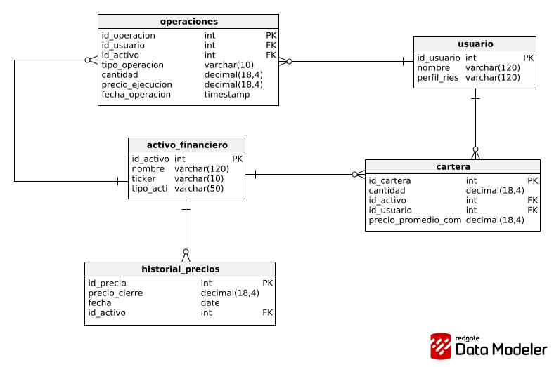
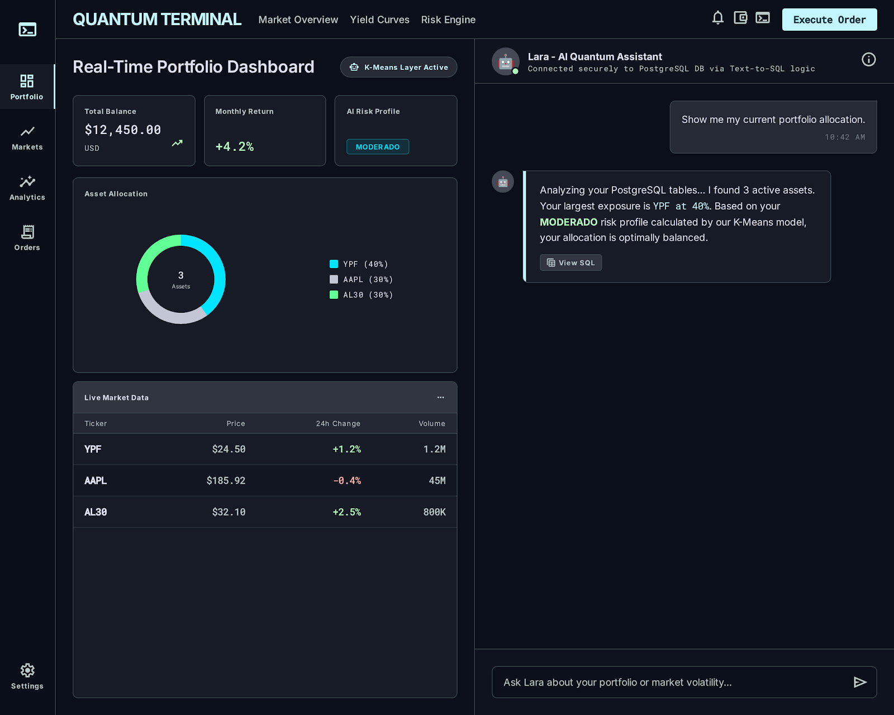

# ai-investment-analytics-assistant (Lara AI) - Asistente de Analítica Financiera
Asistente interactivo de analítica financiera y portafolios (Lara). Desarrollado con Streamlit, segmentación de riesgo mediante Machine Learning (K-Means) y Text-to-SQL sobre PostgreSQL.

**Lara AI** es un MVP transaccional y analítico diseñado para el ecosistema Fintech. El sistema opera como un asistente inteligente de inversiones que reemplaza los formularios estáticos de perfilamiento de riesgo por una **segmentación cuantitativa guiada por datos (Data-Driven)**, basada en el comportamiento real del usuario en el mercado de capitales.

---

## 🎯 El Problema de Negocio
Las instituciones financieras tradicionales suelen clasificar el riesgo de sus clientes mediante encuestas subjetivas. **BuffettMinds** propone un enfoque analítico: extraer la huella transaccional del inversor, procesar las cotizaciones históricas de sus activos y aplicar algoritmos de **Machine Learning No Supervisado** para descubrir matemáticamente su verdadero perfil de riesgo (Conservador, Moderado, Agresivo).

---

## 🏛️ Arquitectura del Sistema y Estado Actual

El proyecto está diseñado bajo los principios de **Clean Architecture**, con una estricta separación de responsabilidades (SRP) entre la capa de datos, la lógica de negocio y la ingesta de APIs externas.

### Fase 1: Modelado Relacional e Inteligencia en Base de Datos (✅ Completado)
El *Ledger* (libro mayor) inmutable del sistema corre sobre **PostgreSQL en un contenedor Docker**.
* **Diseño 3NF:** Esquema normalizado que separa entidades maestras (`usuario`, `activo_financiero`) de las tablas de hechos (`operaciones`, `historial_precios`).
* **Automatización PL/pgSQL:** Para desacoplar cálculos pesados del backend, se implementó un **Trigger `AFTER INSERT`**. Cada nueva transacción ejecuta la función procedural `fn_actualizar_cartera()`, la cual recalcula automáticamente el stock neto y el *Precio Promedio Ponderado de Compra (PPP)* en tiempo real, aplicando validaciones defensivas contra operaciones en descubierto.

### Fase 2: Ingesta Masiva y Robustez Transaccional (✅ Completado)
Pipeline ETL automatizado para la sincronización de cotizaciones de mercado.
* **Extracción y Limpieza:** Integración modular con `yfinance`. Los DataFrames son procesados mediante técnicas de imputación financiera como *Forward Fill (`ffill`)* para manejar nulos en días de feriados bursátiles.
* **Infraestructura de Conexión (Pool & Context Managers):** Implementación de un `ThreadedConnectionPool` para soportar concurrencia. El ciclo de vida de la transacción está blindado por un Context Manager (`@contextmanager`) que garantiza operaciones **ACID** (Auto-commit en éxito, Auto-rollback en fallos de red).
* **Bulk Upserts:** Ingesta de alta eficiencia utilizando `.executemany()` con restricciones de unicidad compuestas (`ON CONFLICT (id_activo, fecha) DO UPDATE`).

---

## 🚀 Próximos Hitos (En Desarrollo)

### Fase 3: Segmentación Cuantitativa - Machine Learning (⏳ En Curso)
Laboratorio de datos en Jupyter Notebooks para la clasificación de usuarios.
* **Feature Engineering:** Extracción mediante SQL del *Volumen Total Expuesto* y la *Volatilidad Histórica (STDDEV)* de las carteras.
* **Preprocesamiento:** Estandarización dimensional mediante `StandardScaler`.
* **Clustering:** Entrenamiento de un modelo **K-Means**. Selección dinámica del número óptimo de clusters ($K$) utilizando el *Método del Codo (Elbow Method)* basado en la métrica de inercia geométrica.

### Fase 4: Interfaz de IA Generativa y Despliegue (🔜 Próximamente)
Construcción de la capa de presentación y el motor cognitivo.
* **Frontend:** Desarrollo de una interfaz de usuario interactiva utilizando **Streamlit**.
* **LLM Integration:** Implementación de un modelo de procesamiento de lenguaje natural (Text-to-SQL) para que los usuarios puedan interrogar su propia rentabilidad y recibir recomendaciones contextualizadas según el riesgo asignado por el modelo K-Means.

---

## 💻 Stack Tecnológico
* **Lenguaje:** Python 3.10+
* **Base de Datos:** PostgreSQL (Docker) / DataGrip
* **Librerías Core:** Pandas, Scikit-Learn, Matplotlib, Psycopg2-binary
* **Próximamente:** Streamlit, LangChain / OpenAI API